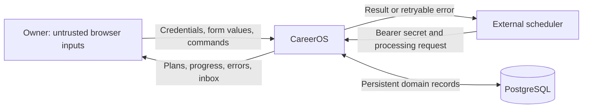
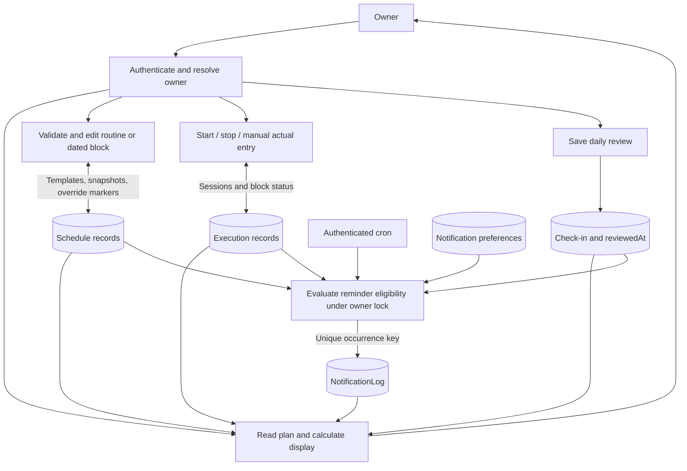
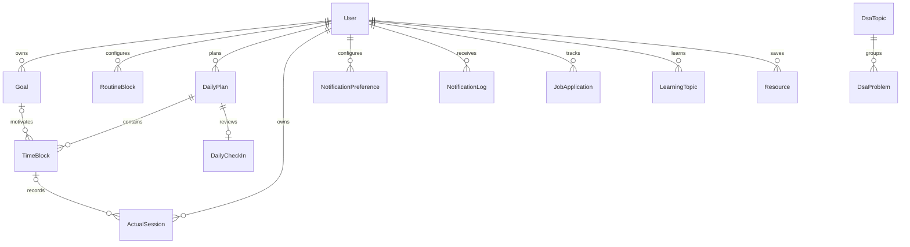

# Data flow diagrams and storage model

## DFD level 0: context and trust boundaries

The browser and scheduler cross separate authentication boundaries. PostgreSQL is reachable by the server, not by the browser. Secrets stay in environment configuration. HTTP resource URLs are displayed as outbound links; CareerOS does not fetch those resources or transmit its database credentials to them.

## DFD level 1: processing and stores

These are logical stores in the same PostgreSQL database, not separate services/databases. Owner/goal records scope these operations. DSA revision dates and job follow-up/interview dates are additional inputs to reminder processing.

## Core entity relationships

The [Prisma schema](../../prisma/schema.prisma) is authoritative for every field and cardinality. `routineKey` is deliberately not a cascading relation: deleting a routine preserves dated history. Resource rows optionally attach to one problem, learning topic, goal or application; a SQL check allows at most one parent. Learning topics support a parent/child hierarchy. Goals and activity categories are flexible text, while lifecycle states are enums.

## Data classification and lifecycle

| Data                                                        | Durable location                    | Exposure / lifecycle                                                         |
| ----------------------------------------------------------- | ----------------------------------- | ---------------------------------------------------------------------------- |
| Profile, plans, actual sessions, reviews, jobs, study notes | PostgreSQL                          | Private owner views; retained until explicitly changed/deleted               |
| Resource URLs                                               | PostgreSQL                          | Validated HTTP(S), clickable; external hosts have their own privacy policies |
| Preferences and reminder history                            | PostgreSQL                          | Owner inbox; read status persists; retention cleanup not implemented         |
| Database credentials, app password, cron secret             | Deployment secrets / ignored `.env` | Server only; rotate if disclosed; never commit                               |
| Unsaved form data and feedback                              | Browser memory                      | Lost on navigation/reload; not claimed durable                               |
| Generated Prisma client / build output                      | Generated files                     | Recreated from source; excluded from Git                                     |
| PostgreSQL backups                                          | Operator-controlled backup storage  | Encryption, retention, access and restore testing required before production |

Job applications are independent of job-search blocks; multiple applications may occur during one session. Cancelling a block preserves its actual sessions. SQL delete semantics differ by relation, so consult migrations before adding a destructive feature. There is no complete user-facing export/erasure/retention workflow yet.
