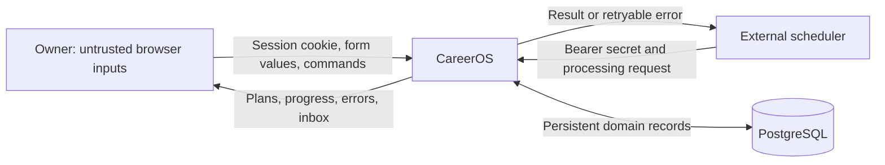
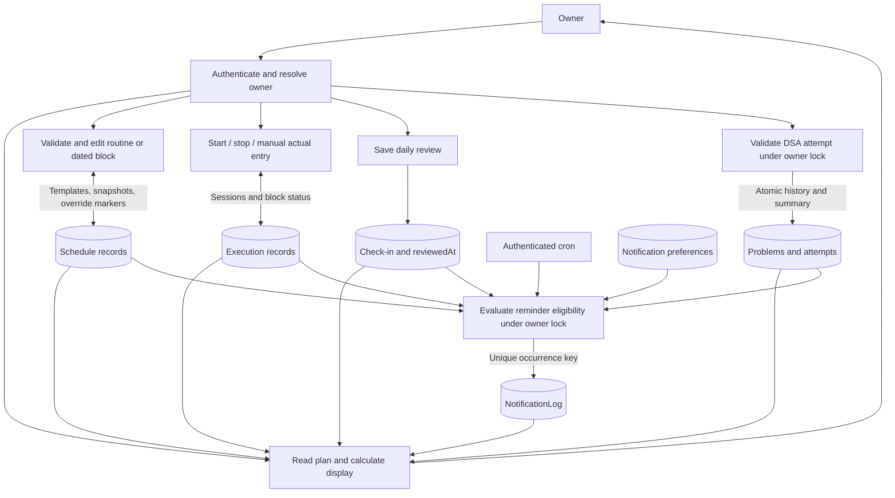
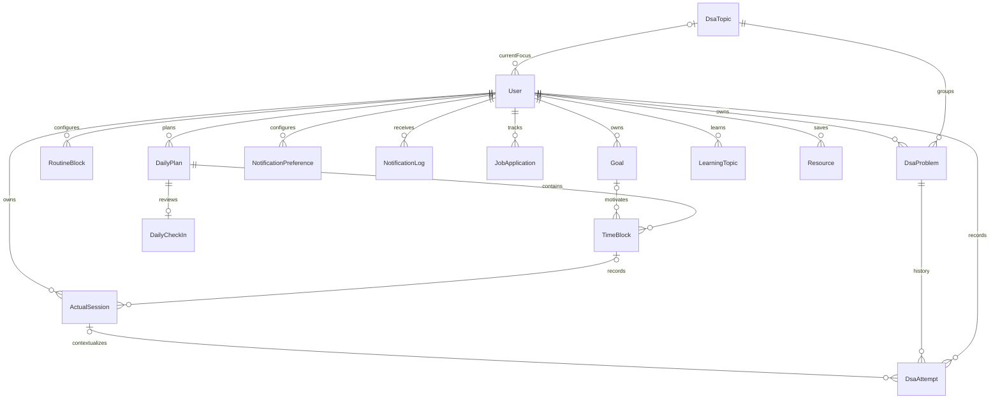
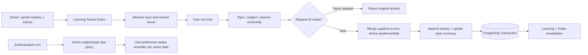
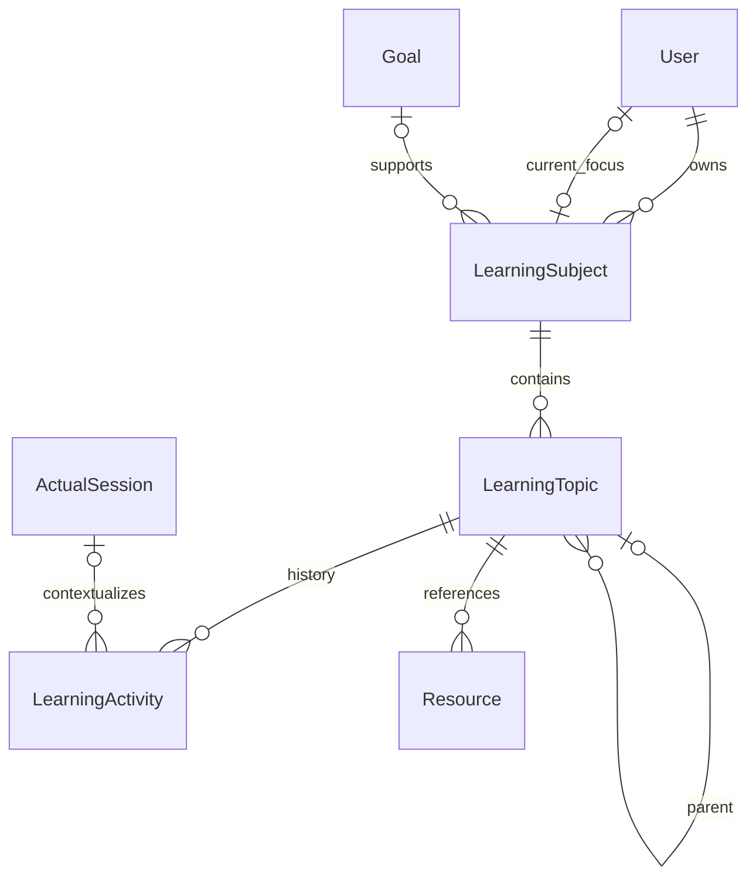
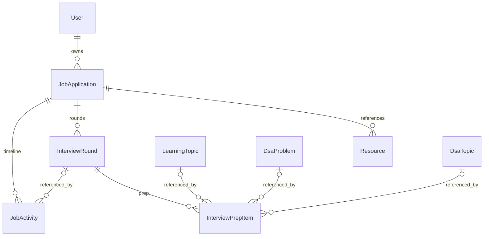
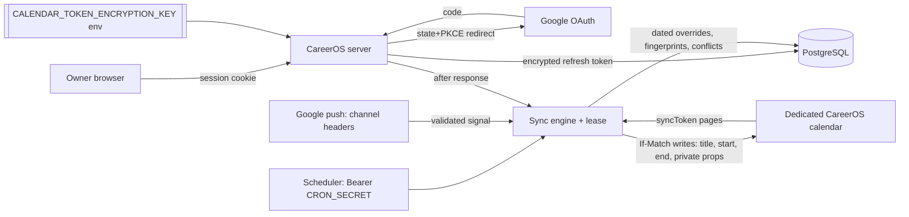

# Data flow diagrams and storage model

## DFD level 0: context and trust boundaries



The browser and scheduler cross separate authentication boundaries. PostgreSQL is reachable by the server, not by the browser. Secrets stay in environment configuration. HTTP resource URLs are displayed as outbound links; CareerOS does not fetch those resources or transmit its database credentials to them.

## DFD level 1: processing and stores



These are logical stores in the same PostgreSQL database, not separate services/databases. Owner/goal records scope these operations. DSA revision dates and job follow-up/interview dates are additional inputs to reminder processing.

## Core entity relationships



The [Prisma schema](../../prisma/schema.prisma) is authoritative for every field and cardinality. `routineKey` is deliberately not a cascading relation: deleting a routine preserves dated history. Resource rows optionally attach to one problem, learning topic, goal or application; a SQL check allows at most one parent. Learning topics support a parent/child hierarchy. Goals and activity categories are flexible text, while lifecycle states are enums.

## Data classification and lifecycle

| Data                                                                                                      | Durable location                    | Exposure / lifecycle                                                                          |
| --------------------------------------------------------------------------------------------------------- | ----------------------------------- | --------------------------------------------------------------------------------------------- |
| Profile, plans, actual sessions, reviews, jobs, study notes                                               | PostgreSQL                          | Private owner views; retained until explicitly changed/deleted                                |
| Resource URLs                                                                                             | PostgreSQL                          | Validated HTTP(S), clickable; external hosts have their own privacy policies                  |
| Preferences and reminder history                                                                          | PostgreSQL                          | Owner inbox; read status persists; retention cleanup not implemented                          |
| Database credentials, cron secret, `AUTH_SECRET`, Google client secret, encryption and VAPID private keys | Deployment secrets / ignored `.env` | Server only; rotate if disclosed; never commit                                                |
| Sessions (token hash, user agent, times)                                                                  | PostgreSQL `Session`                | Cookie holds the token; DB holds only its SHA-256; revoked on sign-out, expires after 30 days |
| Push subscriptions (endpoint, keys)                                                                       | PostgreSQL `PushSubscription`       | Owner-scoped; revoked on 404/410, repeated failure or Disable; excluded from export           |
| Scheduler outcomes                                                                                        | PostgreSQL `JobRun`                 | Timestamps, counts and error class names only                                                 |
| Data export                                                                                               | Owner's download                    | JSON of domain records; no credentials, tokens, sessions or push keys                         |
| Per-device "push enabled" hint                                                                            | Browser `localStorage`              | A single flag so push APIs are not touched before opt-in; no personal data                    |
| Unsaved form data and feedback                                                                            | Browser memory                      | Lost on navigation/reload; not claimed durable                                                |
| Generated Prisma client / build output                                                                    | Generated files                     | Recreated from source; excluded from Git                                                      |
| PostgreSQL backups                                                                                        | Operator-controlled backup storage  | Encryption, retention, access and restore testing required before production                  |

Job applications are independent of job-search blocks; multiple applications may occur during one session. Cancelling a block preserves its actual sessions. SQL delete semantics differ by relation, so consult migrations before adding a destructive feature. Settings offers a JSON export (WI-008). There is no in-app erasure or retention workflow; deleting data is a database operation.

## WI-004 — Technical learning assessment DFD





Technical review dates use existing owner-local day labels and SQL DATE. Activity/session times remain UTC instants. Subject/topic/resource writes validate ownership under the same owner lock. Topic history has no edit/delete mutation. Retry payload mismatches are rejected rather than overwriting the prior activity.

## WI-005 — Job pipeline DFD

```mermaid
flowchart LR
  Owner[Owner: application / stage / round / prep / follow-up] --> Action[Jobs Server Action]
  Action --> Validate[Zod allowlist; HTTP(S) URLs; owner resolved server-side]
  Validate --> Lock[User row lock]
  Lock --> Ownership[Application / round / linked learning+DSA ownership]
  Ownership --> Retry{Request ID seen?}
  Retry -->|Yes| Prior[Return prior result]
  Retry -->|No| Write[Summary change + JobActivity in one transaction]
  Write --> DB[(PostgreSQL)]
  DB --> Views[Jobs, Today, Learn, DSA revalidation]
  Cron[Authenticated cron] --> Eligible[Open apps: follow-up dates; scheduled rounds within 24h]
  Eligible --> Inbox[Deduplicated inbox reminders]
```



Applied/next-action dates are SQL DATEs in the owner's calendar; interview and activity times are UTC instants, with the interview's entry zone stored for display. Recruiter/hiring contacts, compensation notes and job-description snapshots are personal data in the same owner-scoped tables and are never sent to external services. No page scraping, email or calendar calls exist.

## WI-006 — Google Calendar sync DFD



Trust boundaries: the browser never receives tokens. Google receives only titles, instants, the category label and private property IDs. The webhook is unauthenticated at HTTP level but validated by stored channel ID, resource ID, token hash and expiry, and returns no data. Logs carry IDs, codes and counts only.

## WI-007 — Weekly review DFD

```mermaid
flowchart LR
  Sources[(TimeBlock, ActualSession, DsaAttempt, LearningActivity, Job tables)] --> Agg[Pure weekly aggregation]
  Agg --> Page[/review render]
  Owner[Owner] -->|reflection, priorities| Locked[Owner-locked writes]
  Locked --> WR[(WeeklyReview / WeeklyPriority)]
  Owner -->|Prepare next week| Gen[Existing generatePlan x7]
  Gen --> Plans[(DailyPlan / TimeBlock)]
  Plans -. after response .-> Sync[Calendar sync] --> Google[Dedicated calendar]
  Cron[Notification cron] --> Remind[WEEKLY_REVIEW once per week]
```

Metrics are never copied into `WeeklyReview`. Preparation writes only CareerOS rows; any Google call happens later, outside that work.

## WI-008 — Sign-in, sessions and push DFD

```mermaid
flowchart LR
  Browser[Owner browser] -->|Sign in: encrypted state cookie| Auth[Server Action]
  Auth -->|redirect: state, nonce, PKCE| GOIDC[Google OIDC]
  GOIDC -->|code| CB["/api/auth/callback"]
  CB -->|code + verifier, server-to-server| GOIDC
  CB -->|verify claims, OWNER_EMAIL| Sess[(Session: token hash)]
  Browser -->|careeros_session cookie| Proxy[proxy: session / bearer / CSP]
  Proxy --> Pages[Pages and actions: owner scoped]
  Cron[Scheduler: Bearer CRON_SECRET] --> Proc[processNotifications]
  Proc -->|unique occurrence| Inbox[(NotificationLog)]
  Inbox --> Deliver[deliverPending: ≤3 attempts, ≤2h]
  Subs[(PushSubscription)] --> Deliver
  Deliver -->|aes128gcm payload + VAPID JWT| PushSvc[Push service]
  PushSvc --> SW[Service worker] -->|same-origin path| Browser
  Deliver -->|status: sent / failures / revoked| Subs
  Cron --> Jobs[(JobRun)]
```



Trust boundaries: Google sees only the sign-in request and returns identity claims; no Google token is kept for sign-in. Push services see an encrypted payload they cannot read, the endpoint and a VAPID signature. The browser never receives other users' data (there are none) or server secrets; the VAPID public key is public by design. `/api/health` exposes status words only.
