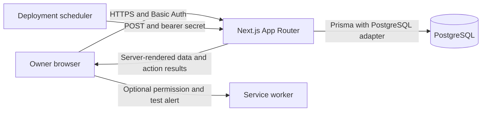

# Architecture

## Scope and runtime

CareerOS is a modular monolith: one Next.js application, one PostgreSQL database, and an external scheduler calling a protected endpoint. The current trust model is one configured owner, not tenant isolation. No queue, Redis, microservice, external calendar connector or AI service exists.

The scheduler is a deployment requirement, not an in-process timer. The service worker does not implement push subscription or closed-app delivery. HTTP is acceptable only for local development; production requires HTTPS.

## Code boundaries

| Boundary               | Responsibility                                                  | Entry points                                                 |
| ---------------------- | --------------------------------------------------------------- | ------------------------------------------------------------ |
| Request authentication | Owner gate and separate cron authorization                      | `src/proxy.ts`, `src/lib/env.ts`                             |
| Server-rendered views  | Scoped queries, rendering, route loading/error states           | `src/app/**/page.tsx`                                        |
| Interactive forms      | Pending/error/preview feedback; unsaved inputs only             | `src/components/action-form.tsx`, schedule forms             |
| Mutation adapters      | Resolve owner, validate inputs, call services, revalidate views | `src/features/schedule/actions.ts`, `src/server/actions.ts`  |
| Pure domain functions  | Dates, recurrences, overlaps, progress, eligibility             | schedule/notification `domain.ts`, `src/lib/time.ts`         |
| Transaction services   | Ownership, locks, generation, edits and execution               | schedule `service.ts` / `editing.ts`, execution `service.ts` |
| Storage                | Prisma client and schema; database constraints                  | `src/server/db.ts`, `prisma/`                                |

Server Components are the default. Small Client Components provide form interaction, navigation, permission UI, error recovery and idle-page refresh. Durable state must never move into a browser store or server singleton. The database client singleton pools connections only.

## Read and write contracts

A page resolves the configured owner before querying their data. A Server Action re-resolves the owner; it never accepts a trusted user ID from the client. Zod parses allowlisted fields. Goal references and block ownership are checked server-side. Domain services serialize schedule/session writes with a `User` row lock, then commit or roll back using Prisma transactions. Views are revalidated only after success.

Routine and block edits carry `updatedAt` versions. Propagation requires a fresh server-computed preview fingerprint. These checks prevent silent overwrites from another tab. The single-open-session partial index independently guards concurrent session starts. Direct SQL writers must follow the locking/overlap contract too; the schema does not enforce full multi-owner relational isolation or closed-session exclusions.

## Domain invariants

- Weekly templates, dated plans and actual sessions represent different facts.
- `(userId, date)` identifies a day. `(routineKey, occurrenceDate)` identifies an original generated occurrence even after it moves.
- Generation snapshots a day once. Cancelled occurrences remain so regeneration cannot resurrect them.
- Daily edits and recorded work are protected from routine propagation.
- Start/stop timestamps come from the server; manual actual time is separately validated.
- Overdue is a derived display state, never automatic evidence that work was skipped.
- UTC instants use `timestamptz`; local calendar dates use SQL `date`; weekly times use validated HH:mm and the owner's IANA zone.
- Reminder identity is unique by owner/type/entity/occurrence; this dedupes inbox records, not hypothetical external push delivery.

## Failure boundaries

Failed schedule mutations return actionable feedback; transactions retain prior data. An invalid DST time aborts that day's generation. Seven-day generation commits per day, so retry is safe but a batch may be partially complete. A stale preview must be requested again. An unfinished session survives process restarts and stays visible.

Database outages show route error states or action errors. Cron failures return HTTP 500 for scheduler retry. Production alerting, load tests and backup recovery evidence are still open NFR items. Review [NFR status](../engineering/non-functional-requirements.md) before deployment.

## Extension rules

Add new use cases to existing feature boundaries. Keep categories user-defined. Add an ADR before changing authentication tenancy, timezone ambiguity, execution concurrency, storage ownership, or introducing a background delivery system. Calendar sync must preserve CareerOS planned blocks as the source of truth; existing external identifiers are preparation, not implemented synchronization.

## DSA feature boundary (WI-003)

`src/features/dsa/domain.ts` owns confidence validation, date intervals and queue ranking. `service.ts` serializes topic/problem/attempt mutations through the existing owner lock; `actions.ts` resolves the owner and refreshes views. Server-rendered dashboard/detail pages and forms expose those services. Notifications reuse the problem summaries, not a second revision algorithm. See ADR-006 for legacy migration, dates and current-topic semantics.

## Technical learning boundary (WI-004)

`src/features/learning/domain.ts` owns mastery/readiness, review policy, queue ranking and suggestions. `service.ts` owns subject/topic/resource/activity writes, owner locks, idempotency, session linkage and read summaries. `actions.ts` resolves the configured owner and revalidates Learning/Today. Server-rendered forms and subject/topic routes reuse existing ActionForm and ResourceLink.

LearningSubject groups existing LearningTopic records. LearningActivity stores supplied scores and before/after statuses; the topic stores current mastery and next calendar review date. No timer mutation or DSA algorithm dependency is introduced. UI labels map legacy `NEEDS_REVISION` to “Needs review”; the shared enum remains compatible with DSA.
