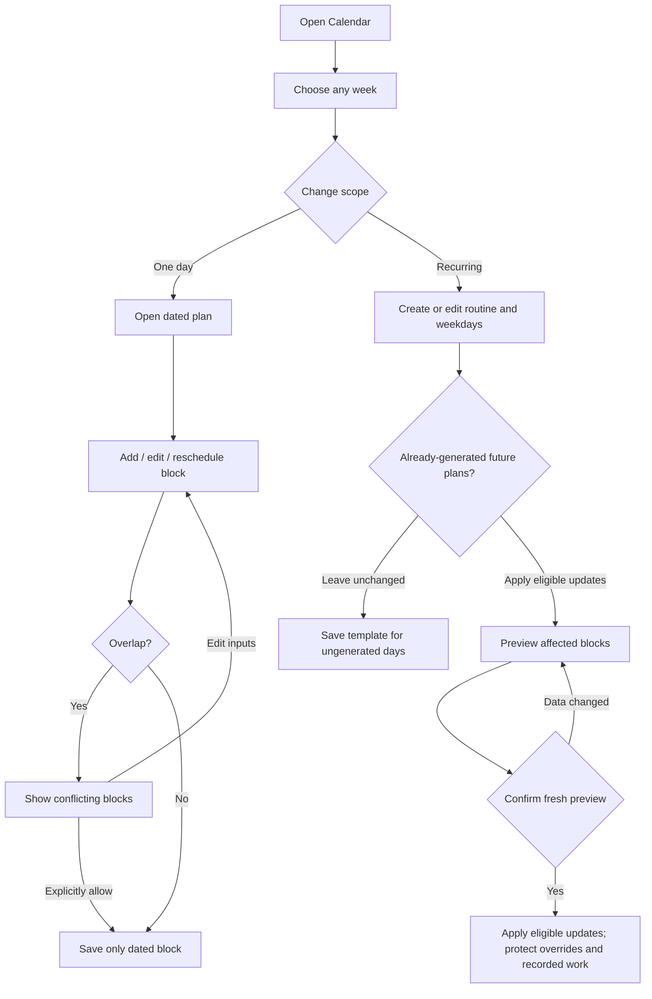
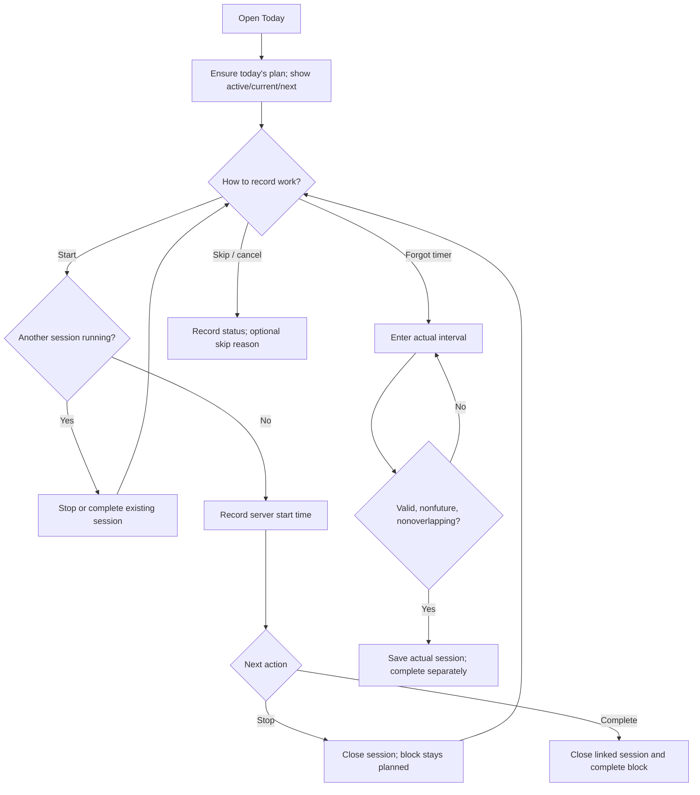
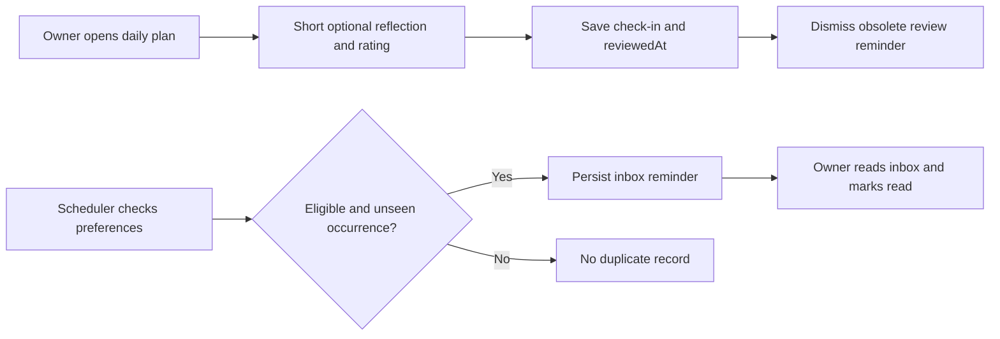
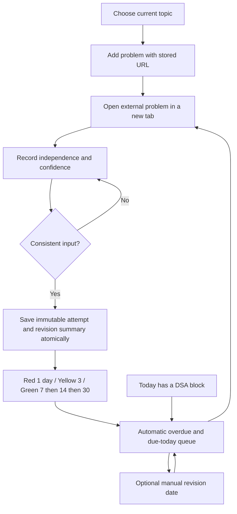
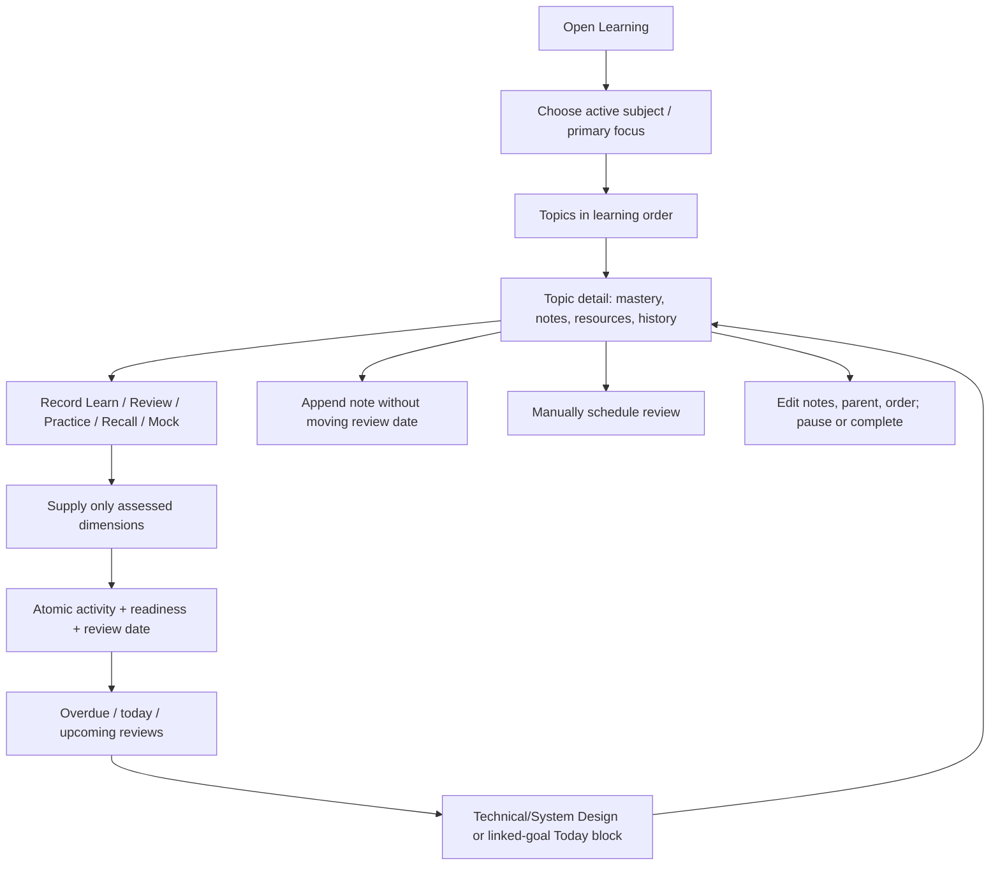
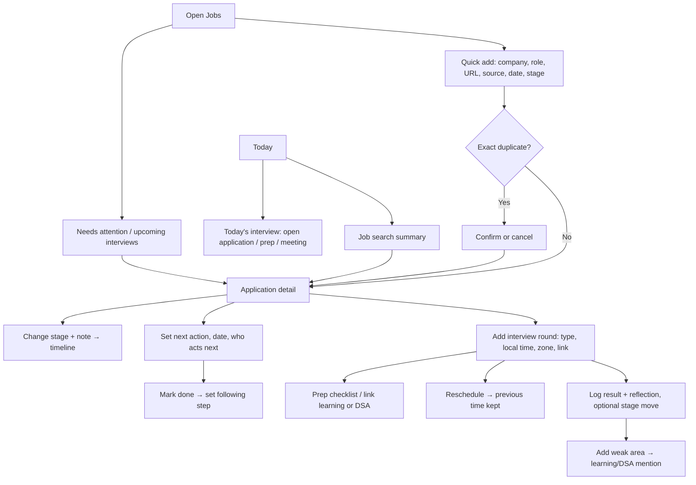
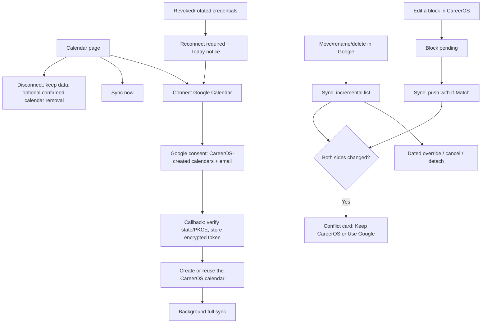
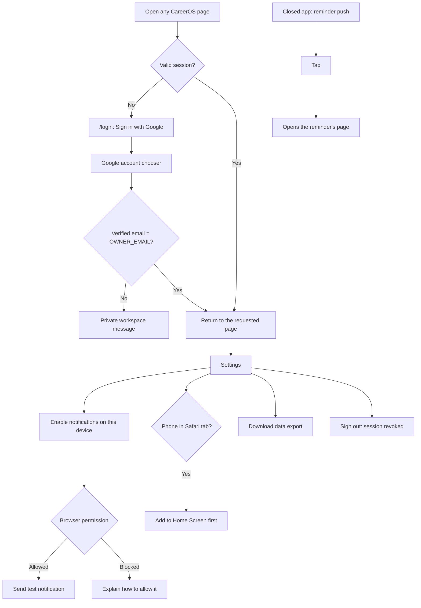

# User flow diagrams (UFD)

These describe implemented WI-001/WI-002/WI-003 paths. UFD means user flow diagram here; data movement is documented separately in the DFD.

## UFD-01: plan a week and override a day



Pause/re-enable changes the template's enabled state. Deletion previews its effect and preserves dated instances by default. New templates can be applied to generated days through their edit form. Generated days remain snapshots. Navigating history alone does not invent historical plans.

## UFD-02: execute and record actual work



A running session must stop before skip/cancel/reschedule. Completing without an active session does not invent elapsed time. Reloading does not lose active work. Merely passing the planned end changes the display to overdue/unrecorded, not skipped.

## UFD-03: review and reminders



The cron can populate the inbox while the app is closed. It cannot deliver an OS push alert in the current implementation. Permission UI provides a test alert only. Daily review carry-forward text does not automatically move tasks.

## UFD-04: DSA practice and revision (WI-003)



Logging an attempt takes two required selections; duration, mistake and notes are optional. A current active DSA session is associated automatically. Scheduling, timer completion and learning confidence are separate decisions.

## UFD-005 — Technical learning, recall and review (WI-004)



A successful form displays confirmation; validation failures preserve input and explain the issue. A new record-activity request ID is issued after revalidation. Pause/archive keeps history but removes active recommendations. Resources use validated HTTP(S) links with safe new-tab attributes. Editing a subject can clear/change primary focus; multiple subjects can remain active.

## UFD-006 — Job pipeline, interviews and follow-ups (WI-005)



Saves show confirmation or keep input with the error. Forms that record events carry a fresh request ID after each save. Closed applications stay reachable through the Rejected/Withdrawn/All views. Grouped lists replace drag-and-drop so the pipeline works by keyboard and on mobile.

## UFD-007 — Google Calendar connection and sync (WI-006)



Results that replace the form (connected, conflict resolved, disconnected) are confirmed with a notice at the top of the panel. Sync errors show sanitized messages only.

## UFD-008 — Weekly review and preparation (WI-007)

```mermaid
flowchart TD
  Sunday[Sunday: Today prompt / inbox reminder] --> Review[Review page: this week]
  Review --> Facts[Execution · Progress · Carry forward (live)]
  Facts --> Reflect[Reflection: save draft or complete]
  Reflect --> Priorities[Choose up to 5 priorities for next week]
  Priorities --> Context[Next week: routine preview, interviews, dues]
  Context --> Routines{Change routines?}
  Routines -->|Yes| Calendar[Edit routines on Calendar] --> Context
  Routines -->|No| Prepare[Prepare next week: generate 7 days once]
  Prepare --> Sync[Calendar sync publishes after the response]
  Review --> History[Previous weeks: stored text, live facts]
```

## UFD-009 — Sign-in, device notifications and data (WI-008)



Sign-in errors return to the login card with a plain message. The checklist on Settings links to each onboarding step.
