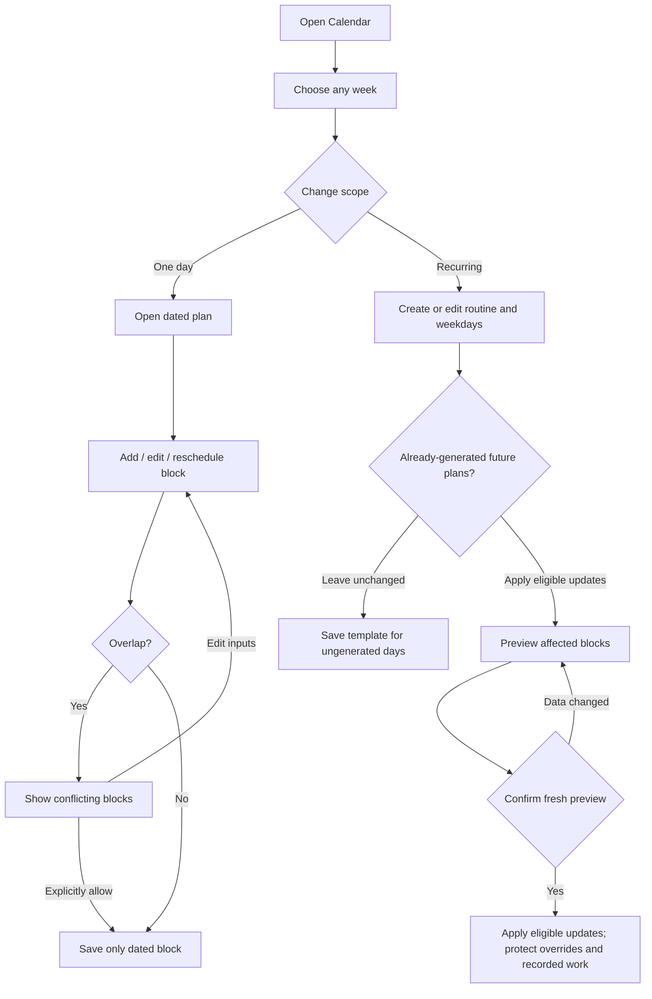
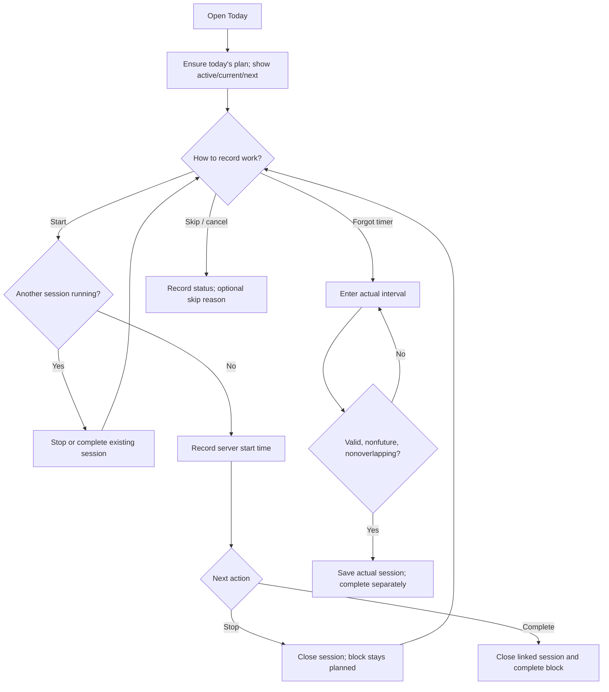
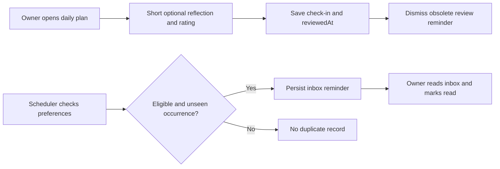
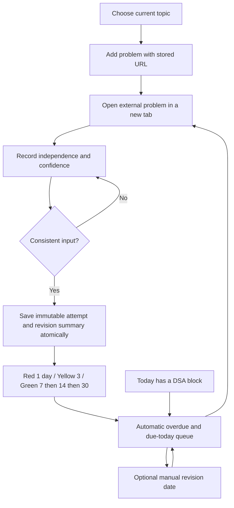

# User flow diagrams (UFD)

These describe implemented WI-001/WI-002/WI-003 paths. UFD means user flow diagram here; data movement is documented separately in the DFD.

## UFD-01: plan a week and override a day

Pause/re-enable changes the template's enabled state. Deletion previews its effect and preserves dated instances by default. New templates can be applied to generated days through their edit form. Generated days remain snapshots. Navigating history alone does not invent historical plans.

## UFD-02: execute and record actual work

A running session must stop before skip/cancel/reschedule. Completing without an active session does not invent elapsed time. Reloading does not lose active work. Merely passing the planned end changes the display to overdue/unrecorded, not skipped.

## UFD-03: review and reminders

The cron can populate the inbox while the app is closed. It cannot deliver an OS push alert in the current implementation. Permission UI provides a test alert only. Daily review carry-forward text does not automatically move tasks.

## UFD-04: DSA practice and revision (WI-003)

Logging an attempt takes two required selections; duration, mistake and notes are optional. A current active DSA session is associated automatically. Scheduling, timer completion and learning confidence are separate decisions.
